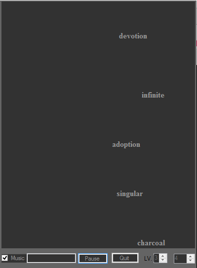

# Simple-Typing-Game

# 一个简单的打字游戏

## Features

## 描述

A simple, rough and fragile .NET typing game.

简单，粗暴。

Frankly, all its value is just memory.

纪念被老师用 C++.NET 双重轮奸的那几个月。

It was developed under Visual Studio 2013 CLR via C++
(This took me some efforts searching on Google for
a solution of writing .NET application via C++
under either VS2012 or VS2013.)
In order to gain overall aquaintance of .NET framework
as much as possible merely through these simple codes
(I have no idea to further my .NET knowledge,
say, I will not write .NET apps in the future),
using statement was completely abandoned.
Therefore, ^_^, don't wonder why there are abundant :: tokens.

开发环境： VS2013 CLR via C++。

为了只通过项目的开发中获得对 .NET 的最大了解，
我彻底没有使用 using 语句，
因而必须指定完整的名字空间，
进而尽可能获得对 .NET 布局的整体感知。

## TODO

## 改进

- Revenge

- 复仇

## Copyright

## 版权

Copyright 2015 Gu Zhengxiong <rectigu@gmail.com>

## License

## 授权

GPL
